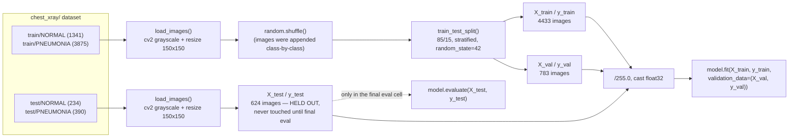
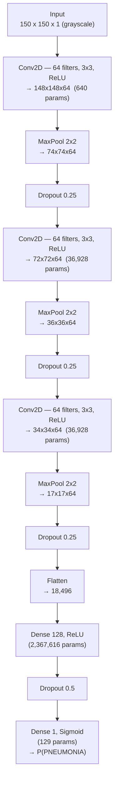

# Day 25 — Retraining the Pneumonia CNN with real GPU compute

Resumed after the compute barrier that stalled this project at Day 24 (training CNNs on Kaggle's free-tier CPU/limited-GPU compute). New workstation: Quadro T2000, 4GB VRAM.

## 1. Environment setup (new machine)

| Step | Detail |
|---|---|
| Install | `pip install "tensorflow[and-cuda]"` inside a fresh venv (`env/`) — pulls CUDA/cuDNN as pip packages, no system CUDA Toolkit needed |
| GPU gotcha | TF couldn't `dlopen` the pip-installed CUDA libs — `LD_LIBRARY_PATH` had to be pointed at `site-packages/nvidia/*/lib` explicitly. Baked into both `env/bin/activate` and the Jupyter kernel's `kernel.json` so it works regardless of how the notebook launches. Full writeup: `~/Desktop/Learnings/Machine Learning/Local GPU Setup For TensorFlow.md` |
| Dataset auth | Kaggle's local API auth changed to a single token (`~/.kaggle/access_token`), not the old `kaggle.json` username+key format |
| Dataset | `kaggle datasets download -d paultimothymooney/chest-xray-pneumonia -p datasets/ --unzip` — matches the `/kaggle/input/chest-xray-pneumonia/chest_xray/...` path the Day 24 notebook used on Kaggle |

## 2. Data pipeline

**Bugs fixed vs Day 24:**
- Day 24 set `data_val_dir = data_dir` (both pointed at `train/`) — its "validation" metrics during training were silently just re-scoring training data. Fixed here: `val` is a real stratified 15% slice of the train pool, and the official `test/` folder is the only thing used for final evaluation.
- Day 24 hardcoded `class_weight = {0: 1, 1: 5}` (a guess). Fixed here: computed via `sklearn.utils.class_weight.compute_class_weight('balanced', ...)` from the actual training-split class counts — `{NORMAL: 1.944, PNEUMONIA: 0.673}` (PNEUMONIA outnumbers NORMAL ~3:1 in this dataset, so the minority class gets upweighted).

## 3. Model architecture

3× `(Conv2D → MaxPool → Dropout)` blocks, then a dense head. Dropout/regularization carried over from Day 23 (Day 24 had dropped it).

**Total: 2,442,241 params (9.32 MB), all trainable.** Loss: `binary_crossentropy`. Optimizer: `Adam(lr=1e-4)`. Metrics tracked: Recall + Precision (not just accuracy — with a ~3:1 class imbalance, accuracy alone hides exactly the failure mode found below).

## 4. Training

- `batch_size=32` **OOM'd** on the 4GB card (`Out of memory while trying to allocate 738.98MiB`) — the 3 stacked conv layers' activation memory for a batch of 150×150 images adds up fast on a small GPU. Dropped to `batch_size=16`, ran clean.
- `EarlyStopping(monitor='val_loss', patience=5, restore_best_weights=True)` — never triggered; all 25 epochs ran.
- `tf.config.experimental.set_memory_growth(gpu, True)` set before any other TF call, so TF doesn't pre-grab the whole 4GB.

## 5. Results

| Split | Recall | Precision |
|---|---|---|
| Train | 0.981 | 0.993 |
| Val (stratified slice of train pool) | 0.993 | 0.981 |
| **Test (official held-out folder)** | — | — |

**Test set confusion matrix** (rows = actual, cols = predicted):

|  | Predicted NORMAL | Predicted PNEUMONIA |
|---|---|---|
| **Actual NORMAL** (234) | 106 | **128** |
| **Actual PNEUMONIA** (390) | 3 | 387 |

| Class | Precision | Recall | F1 |
|---|---|---|---|
| NORMAL | 0.9725 | **0.4530** | 0.6181 |
| PNEUMONIA | 0.7515 | 0.9923 | 0.8552 |

Overall test accuracy: **79.0%**.

## 6. Why the gap — verified, not assumed

Train/val recall was ~98–99% on both classes; the real held-out test set tells a different story — 128 of 234 actual NORMAL x-rays (55%) got called PNEUMONIA. This is **not** a leakage bug — val was a genuine stratified split of the train pool, separate from test throughout.

To find the actual cause instead of guessing, sampled 80 images per class per split and compared raw pixel stats:

| | train | test |
|---|---|---|
| Mean brightness — NORMAL | 120.0 | **124.9** |
| Mean brightness — PNEUMONIA | **125.1** | 118.3 |

**The brightness relationship between classes inverts between train and test.** In train, PNEUMONIA images are brighter on average; in test, NORMAL images are brighter. If the CNN partly learned "brightness" as a cheap shortcut cue (a well-known thing CNNs do before they bother learning genuine texture), that cue actively points backwards on test data — pushing brighter test NORMAL images toward the "PNEUMONIA" prediction. That matches the failure mode above exactly.

A second, more blatant artifact in this specific dataset: **image resolution correlates with class in both splits** (PNEUMONIA images are consistently lower-resolution than NORMAL images — e.g. train: 1222×845 vs 1651×1357). This is a documented flaw of this Kaggle dataset — the label is partially leakable from image metadata alone, before content is even considered.

Logged as a general gotcha (good val score ≠ guaranteed generalization, even with a clean split) in `~/Desktop/Learnings/Machine Learning/Model Evaluation And Ensembles.md`.

## 7. Decision

Banked this result as Day 25 rather than iterating further right now. Next levers, if revisited:
- **Data augmentation** (rotation/zoom/shift via `ImageDataGenerator`) — fights reliance on global-brightness shortcuts by forcing the model to see varied lighting/framing per class.
- **Grad-CAM / saliency map** on misclassified NORMAL test images — would directly confirm whether the model's "attention" is diffuse (shortcut-driven) vs. focused on lung regions (genuine feature-driven).
- **TFLite export** for edge deployment — flagged in Day 24's notes on post-deployment monitoring, still open.
